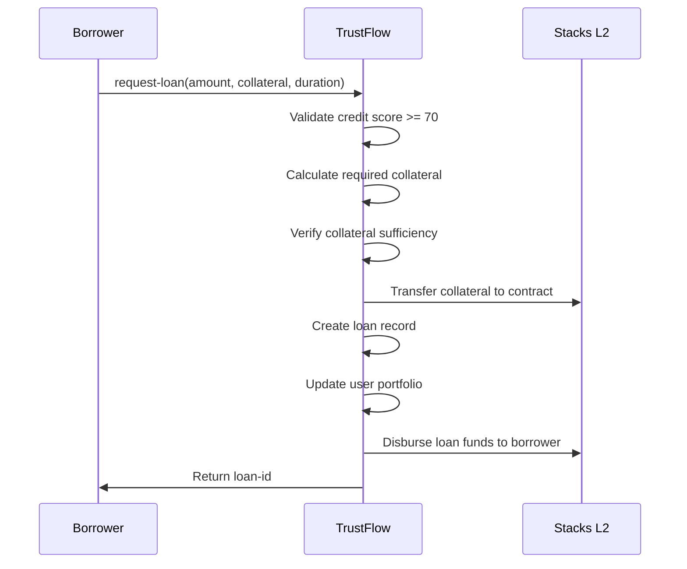
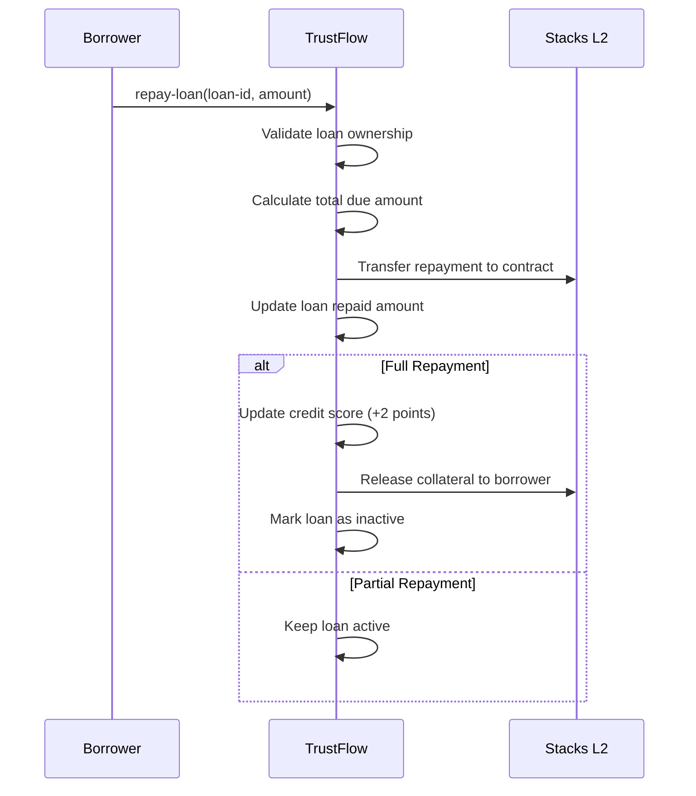

# TrustFlow - Dynamic Credit Lending Protocol

[](https://stacks.co)
[](https://github.com/hirosystems/clarinet)
[](LICENSE)

## Overview

TrustFlow is a revolutionary peer-to-peer lending platform that introduces intelligent credit assessment and reputation-based loan qualification on Bitcoin's Layer 2. The protocol creates a sustainable lending marketplace that rewards responsible financial behavior while maintaining robust security against default risks.

### Key Features

- **Adaptive Collateral Requirements**: Dynamic collateral ratios (50-100%) based on borrower reputation
- **Credit-Based Interest Rates**: Preferential rates (5-10% APR) for high-credit users  
- **Progressive Credit Scoring**: Evolving reputation system (50-100 points)
- **Multi-Loan Portfolio Management**: Support for up to 5 concurrent loans per user
- **Automated Risk Management**: Real-time default detection and liquidation
- **Bitcoin-Native Security**: Built on Stacks blockchain for maximum security

## Architecture

### System Overview

```text
┌─────────────────┐    ┌─────────────────┐    ┌─────────────────┐
│   Borrowers     │    │   TrustFlow     │    │   Lenders       │
│                 │    │   Protocol      │    │   (Future)      │
│ • Request Loans │───▶│                 │◀───│ • Fund Pools   │
│ • Repay Loans   │    │ • Credit Scoring│    │ • Earn Yield    │
│ • Build Credit  │    │ • Risk Assessment│   │ • Manage Risk   │
└─────────────────┘    │ • Collateral Mgmt│   └─────────────────┘
                       └─────────────────┘
                               │
                               ▼
                       ┌─────────────────┐
                       │   Stacks L2     │
                       │                 │
                       │ • STX Transfers │
                       │ • Smart Contracts│
                       │ • Block Heights │
                       └─────────────────┘
```

### Contract Architecture

#### Core Components

1. **Credit Scoring Engine**
   - Dynamic reputation tracking
   - Behavioral pattern analysis
   - Risk-adjusted scoring (50-100 points)

2. **Loan Management System**
   - Multi-loan portfolio tracking
   - Automated repayment processing
   - Default detection and liquidation

3. **Collateral Management**
   - Adaptive collateral requirements
   - Automated escrow and release
   - Risk-based ratio calculation

4. **Interest Rate Engine**
   - Credit-based rate determination
   - Dynamic pricing (5-10% APR)
   - Market-responsive adjustments

#### Data Structures

```clarity
;; User Credit Profile
UserScores: {
  score: uint,           // Current credit score (50-100)
  total-borrowed: uint,  // Lifetime borrowing amount
  total-repaid: uint,    // Lifetime repayment amount
  loans-taken: uint,     // Total loans originated
  loans-repaid: uint,    // Successfully repaid loans
  last-update: uint      // Last score update block
}

;; Loan Record
Loans: {
  borrower: principal,   // Loan recipient
  amount: uint,          // Principal amount
  collateral: uint,      // Escrowed collateral
  due-height: uint,      // Repayment deadline
  interest-rate: uint,   // Applied interest rate
  is-active: bool,       // Current loan status
  is-defaulted: bool,    // Default flag
  repaid-amount: uint    // Amount repaid to date
}
```

## Data Flow

### Loan Origination Process



### Repayment Process



### Credit Score Dynamics

| Action | Score Change | Impact |
|--------|--------------|---------|
| Successful Repayment | +2 points | Lower collateral requirements, better rates |
| Loan Default | -10 points | Higher collateral requirements, limited access |
| First-time User | 50 points | Standard terms, growth potential |
| Maximum Score | 100 points | Minimum collateral (50%), best rates (5% APR) |

## Getting Started

### Prerequisites

- [Clarinet](https://github.com/hirosystems/clarinet) - Stacks development environment
- [Node.js](https://nodejs.org/) v16+ - For testing framework
- [Git](https://git-scm.com/) - Version control

### Installation

1. Clone the repository:

```bash
git clone https://github.com/romota-yusuf/trust-flow.git
cd trust-flow
```

2. Install dependencies:

```bash
npm install
```

3. Verify contract syntax:

```bash
clarinet check
```

4. Run tests:

```bash
npm test
```

### Development Workflow

1. **Contract Development**: Edit `contracts/trust-flow.clar`
2. **Testing**: Add tests in `tests/trust-flow.test.ts`
3. **Validation**: Run `clarinet check` to verify syntax
4. **Testing**: Execute `npm test` to run test suite

## Usage Examples

### Initialize Credit Profile

```clarity
;; First-time users must initialize their credit profile
(contract-call? .trust-flow initialize-score)
```

### Request a Loan

```clarity
;; Request 1000 STX loan with 800 STX collateral for 1000 blocks
(contract-call? .trust-flow request-loan u1000 u800 u1000)
```

### Repay a Loan

```clarity
;; Repay 500 STX towards loan #1
(contract-call? .trust-flow repay-loan u1 u500)
```

### Query Credit Score

```clarity
;; Check user's current credit profile
(contract-call? .trust-flow get-user-score 'ST1HTBVD3JG9C05J7HBJTHGR0GGW7KXW28M5JS8QE)
```

## Risk Parameters

### Credit Score Thresholds

- **Minimum Score**: 50 points (new users)
- **Lending Threshold**: 70 points (minimum to borrow)
- **Maximum Score**: 100 points (optimal terms)

### Collateral Requirements

- **High Credit (90-100)**: 50% collateral ratio
- **Good Credit (80-89)**: 65% collateral ratio  
- **Fair Credit (70-79)**: 80% collateral ratio
- **Below Threshold (<70)**: Lending disabled

### Interest Rates

- **Premium Tier (90-100)**: 5% APR
- **Standard Tier (80-89)**: 6.5% APR
- **Basic Tier (70-79)**: 8% APR

## Security Considerations

### Access Controls

- Contract owner privileges limited to default marking
- User-specific loan access restrictions
- Automated collateral management

### Risk Mitigation

- Multi-loan limits (5 active loans max)
- Duration restrictions (max 52,560 blocks ≈ 1 year)
- Real-time default detection
- Automated liquidation processes

## Testing

Run the comprehensive test suite:

```bash
npm test
```

Test coverage includes:

- Credit score initialization and updates
- Loan origination and validation
- Repayment processing
- Default handling
- Edge cases and error conditions

## Contributing

1. Fork the repository
2. Create a feature branch: `git checkout -b feature-name`
3. Commit changes: `git commit -m 'Add feature'`
4. Push to branch: `git push origin feature-name`
5. Submit a pull request

## Roadmap

### Phase 1 (Current)

- ✅ Core lending functionality
- ✅ Credit scoring system
- ✅ Collateral management

### Phase 2 (Planned)

- [ ] Lending pool integration
- [ ] Governance token implementation
- [ ] Advanced risk metrics

### Phase 3 (Future)

- [ ] Cross-chain collateral support
- [ ] Institutional lending features
- [ ] Mobile application interface

## License

This project is licensed under the MIT License - see the [LICENSE](LICENSE) file for details.

## Support

- **Documentation**: [Wiki](https://github.com/romota-yusuf/trust-flow/wiki)
- **Issues**: [GitHub Issues](https://github.com/romota-yusuf/trust-flow/issues)
- **Discussions**: [GitHub Discussions](https://github.com/romota-yusuf/trust-flow/discussions)

---

Built with ❤️ on Bitcoin Layer 2 using Stacks blockchain
